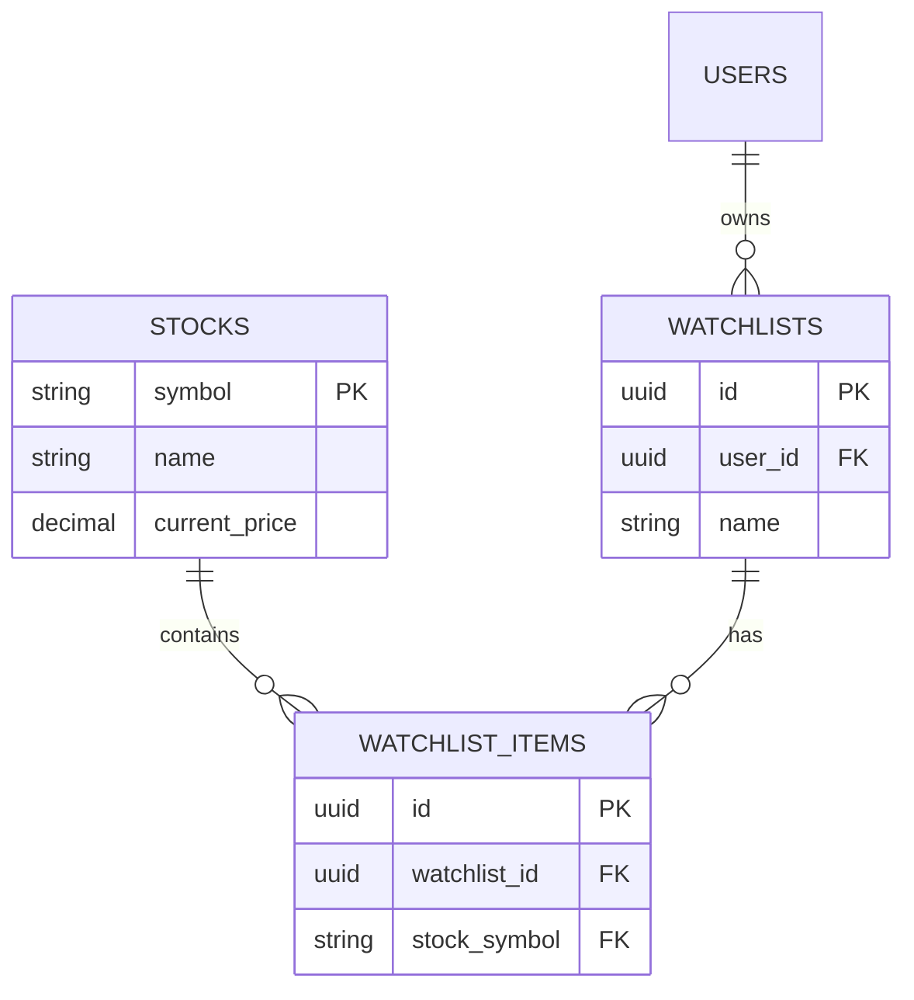

# Supabase Guide for Stock Watchlist

This project uses [Supabase](https://supabase.com/) for its database (PostgreSQL) and authentication. It handles real-time data storage for stock information and user watchlists.

## Database Schema

The database consists of three main tables:

### `stocks`
Stores cached fundamental data for stock symbols.
- `symbol` (TEXT, Primary Key): The stock ticker (e.g., AAPL).
- `name` (TEXT): The full name of the company.
- `pe_ratio_ttm` (DECIMAL): Trailing twelve months PE ratio.
- `pe_ratio_forward` (DECIMAL): Forward PE ratio.
- `fcf_yield` (DECIMAL): Free Cash Flow yield.
- `sma_200`, `sma_100`, `sma_50`, `sma_20` (DECIMAL): Simple Moving Averages.
- `current_price` (DECIMAL): The last fetched price.
- `last_updated` (TIMESTAMPTZ): When the record was last refreshed from FMP.
- `metadata` (JSONB): Additional data fields.

### `watchlists`
Stores user-created watchlists.
- `id` (UUID, Primary Key): Unique identifier.
- `user_id` (UUID): Reference to `auth.users(id)`.
- `name` (TEXT): Name of the watchlist.
- `created_at` / `updated_at` (TIMESTAMPTZ).

### `watchlist_items`
Links stocks to watchlists (Many-to-Many).
- `id` (UUID, Primary Key).
- `watchlist_id` (UUID): Reference to `public.watchlists(id)`.
- `stock_symbol` (TEXT): Reference to `public.stocks(symbol)`.
- `created_at` (TIMESTAMPTZ).

## Relations

## Useful Supabase CLI Commands

For local development, use the following commands via `npx supabase`:

- `npx supabase status`: Check the status of your local Supabase services.
- `npx supabase start`: Start the local Supabase environment (Docker required).
- `npx supabase stop`: Stop the local Supabase environment.
- `npx supabase db reset`: Reset your local database to its initial state.
- `npx supabase migration new <name>`: Create a new migration file.
- `npx supabase db push`: Push local migrations to your remote project.

## Project Setup

### Environment Variables
Required variables in `.env.local`:
- `NEXT_PUBLIC_SUPABASE_URL`: Your Supabase project URL.
- `NEXT_PUBLIC_SUPABASE_ANON_KEY`: Your project's anonymous key.
- `SUPABASE_SERVICE_ROLE_KEY`: Service role key (use only on server-side).

### Supabase Client
The client is initialized in [src/lib/supabase.ts](file:///Users/samarthagarwal/dev/stock_watchlist/src/lib/supabase.ts). It exports both a standard client (`supabase`) and a service-role client (`supabaseService`) if the key is provided.

## Row Level Security (RLS)
- **`stocks`**: Publicly readable (`SELECT true`).
- **`watchlists`**: Only accessible by the owner (`auth.uid() = user_id`).
- **`watchlist_items`**: Only accessible if the parent watchlist belongs to the user.
